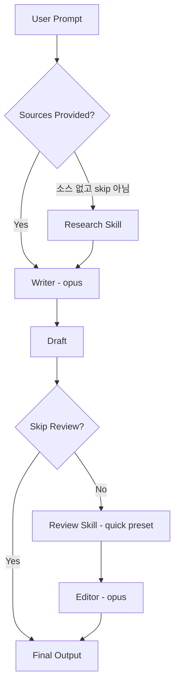

[English](write.md) | **한국어**

# Write

> 찾은 것과 분석한 것을 초안으로 쓰는 손. 생략하지 않으면 리서치와 리뷰는 이 스킬 내부의 기본 흐름입니다.

## 빠른 예시

```
AI 에이전트의 미래에 대한 아티클을 써줘
```

**동작 방식:** 호출자가 `--skip-research` 또는 `--skip-review`를 지정하지 않으면 write 스킬 내부 기본 흐름으로 리서치·초안·리뷰를 수행하고 Critical/Major 소견을 반영합니다. 이는 훅 수준의 자동 트리거가 아니라 write 스킬의 기본 동작입니다.

## 실전 예시

**입력:**
```
AI 에이전트의 미래에 대한 전문가 아티클을 써줘, 약 800단어
```

**진행 과정:**
1. 자료를 직접 제공하지 않았다면 선택한 research depth(정확히 3회, 정확히 5회, 10회 이상 검색)로 내부 리서치를 수행합니다. 플래그로 생략할 수 있습니다.
2. 라이터(opus)가 `article` 포맷 + `expert` 문체로 초안 작성: 권위 있고, 증거 기반이며, 도메인 용어를 사용.
3. 분량 협상 활성화: 아티클 포맷 최소 기준은 4,000자, 사용자 요청은 약 800단어. 스킬이 사용자에게 알리고 대안을 제시.
4. 내부 리뷰는 기본적으로 `quick` 프리셋(devil-advocate + fact-checker, 2명)을 사용합니다. `--skip-review`로 생략할 수 있습니다.
5. 에디터(opus)가 모든 Critical/Major 소견을 반영하여 수정.

**출력 예시:**
> 2026년 3월 현재, AI 에이전트 시장은 전례 없는 속도로 성장하고 있다. Grand View Research에 따르면 글로벌 AI 에이전트 시장 규모는 2025년 76억 3천만 달러에서 2026년 109억 1천만 달러로, 단 1년 만에 43% 이상 팽창했다.
>
> **품질 점검:** 실제 실행에서 확인한 출처·근거 범위·문체 일관성을 보고하며 고정 점수나 출처 수를 의미하지 않습니다.

## 옵션

| 플래그 | 값 | 기본값 |
|--------|-----|--------|
| `--format` | `newsletter\|article\|shorts\|report\|social\|card-news` | `article` |
| `--voice` | `peer-mentor\|expert\|casual` | 포맷별 기본값 |
| `--publish` | `notion\|file` | `file` |
| `--skip-research` | flag | off |
| `--skip-review` | flag | off |
| `--lang` | `ko\|en` | `ko` |
| `--input` | 파일 경로 | 없음 |
| `--constraints` | 쉼표로 구분한 문자열 | 없음 |

### 문체(Voice)

| 문체 | 기본 적용 포맷 |
|------|---------------|
| `peer-mentor` | newsletter |
| `expert` | report, article |
| `casual` | shorts, social, card-news |

### 포맷 규칙

| 포맷 | 최소 분량 | 핵심 요건 |
|------|----------|----------|
| `newsletter` | 10,000자 | 6단계 내러티브 아크, 리서치 데이터 2개 이상 |
| `article` | 4,000자 | 증거 기반 구조 |
| `report` | 5,000자 | 번호 매긴 권고안 |
| `shorts` | 약 1,800자 | CTA 필수 |
| `social` | 플랫폼 최적화 | 짧은 포스트 |
| `card-news` | 슬라이드 단위 | 슬라이드별 비주얼 방향 |

### 분량 협상

사용자 지정 분량이 포맷 최소 기준과 충돌할 때:
1. 스킬이 사용자에게 충돌 사실을 알립니다.
2. 대안 제시: 더 짧은 포맷으로 전환하거나, 원래 포맷의 최소 분량을 유지.
3. 사용자가 고수하면 의도를 존중하되, 출력 메타데이터에 오버라이드 사실을 기록.

스킬은 사용자 요청을 무단으로 축소하거나 초과하지 않습니다.

`--input`은 소스 자료를 제공하며 `--skip-research`를 암시합니다. `--constraints`는
초안에 주입되는 하드 요구사항입니다(예: PDCA Act → Do에서 전달).

## 작동 원리


```mermaid
graph TD
    A[User Prompt] --> B{Sources Provided?}
    B -->|소스 없고 skip 아님| C[Research Skill]
    B -->|Yes| D[Writer - opus]
    C --> D
    D --> E[Draft]
    E --> F{Skip Review?}
    F -->|No| G[Review Skill - quick preset]
    F -->|Yes| I[Final Output]
    G --> H[Editor - opus]
    H --> I
```

## 주의사항

- **소스 없이 리서치 생략** -- 실제 소스 자료가 이미 제공된 경우에만 `--skip-research`를 사용하세요. 라이터에게 근거가 필요합니다.
- **숏폼에 CTA 누락** -- `shorts`와 `social` 포맷에는 콜투액션이 필수입니다. 라이터 제약이 이를 강제합니다.
- **리뷰 없이 발행** -- 리뷰 패스가 Critical/Major 이슈를 잡아냅니다. 생략하면 결함 있는 콘텐츠가 발행될 위험이 있습니다.

## 문제 해결

- **요청 분량과 포맷 최소치가 부딪힌다** -- 스킬이 분량 협상을 겁니다. 충돌을 알리고 선택지를 줍니다(더 짧은 포맷으로 바꾸거나, 원래 포맷의 최소치를 지키거나). 말없이 잘라내거나 늘리지 않습니다.
- **리서치가 너무 느리다** -- `--skip-research`를 쓰고 자료를 직접 주십시오. 작성에는 근거가 필요하므로, 실제 소스가 이미 있을 때만 건너뛰십시오.
- **영어로 나올 줄 알았는데 한국어로 나온다** -- 기본 언어가 `ko`입니다. 영어가 필요하면 `--lang en`을 명시하십시오.
- **리뷰 소견이 반영되지 않았다** -- `--skip-review`가 붙어 있으면 리뷰 패스가 돌지 않습니다. 플래그를 빼면 Critical/Major 소견이 자동으로 검토·반영됩니다.

## 연동 스킬

| 스킬 | 관계 |
|------|------|
| research | 자료가 없을 때 초안 전 내부 호출 (`--skip-research` 미설정 시) |
| review | 초안 후 `quick` 프리셋으로 내부 호출 (`--skip-review` 미설정 시) |
| workflow | 커스텀 워크플로우의 한 단계로 연결 가능 |
| refine | 리뷰 소견 반영 후 반복 개선 |
