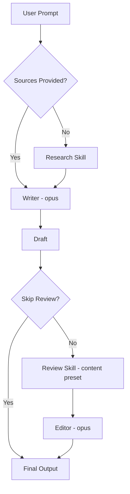

# Write

> Produce newsletters, articles, reports, shorts, or social content with automatic research and review.

## Quick Example

```
Write a newsletter about multi-agent AI systems
```

**What happens:** The skill auto-triggers a research phase, drafts content in the selected format and voice, runs a review pass via the review skill, then applies an editing pass to address all Critical and Major findings.

## Real-World Example

**Input:**
```
Write an expert article about the future of AI agents, approximately 800 words
```

**Process:**
1. Research phase triggers automatically -- 5 web searches covering market data, enterprise adoption, challenges, case studies, and multi-agent architecture.
2. Writer (opus) drafts in `article` format with `expert` voice: authoritative, evidence-led, domain vocabulary.
3. Length negotiation activates: article format minimum is 3,000 words, user requested ~800. The skill informs the user and offers alternatives.
4. Review auto-triggers with the `content` preset (deep-reviewer + devil-advocate + tone-guardian).
5. Editor (opus) addresses all Critical and Major review findings.

**Output excerpt:**
> 2026년 3월 현재, AI 에이전트 시장은 전례 없는 속도로 성장하고 있다. Grand View Research에 따르면 글로벌 AI 에이전트 시장 규모는 2025년 76억 3천만 달러에서 2026년 109억 1천만 달러로, 단 1년 만에 43% 이상 팽창했다.
>
> **Test quality:** 7/10 -- 12+ sources cited, every major claim backed by data, expert voice consistent throughout.

## Options

| Flag | Values | Default |
|------|--------|---------|
| `--format` | `newsletter\|article\|shorts\|report\|social\|card-news` | `newsletter` |
| `--voice` | `peer-mentor\|expert\|casual` | format-specific |
| `--publish` | `notion\|file` | `file` |
| `--skip-research` | flag | off |
| `--skip-review` | flag | off |
| `--lang` | `ko\|en` | `ko` (set `--lang en` for English output) |

### Voices

| Voice | Default For |
|-------|-------------|
| `peer-mentor` | newsletter |
| `expert` | report, article |
| `casual` | shorts, social |

### Format Rules

| Format | Minimum Length | Key Requirement |
|--------|--------------|-----------------|
| `newsletter` | 2,000 words | 6-stage arc, 2+ research data points |
| `article` | 3,000 words | Evidence-led structure |
| `report` | 4,000 words | Numbered recommendations |
| `shorts` | ~300 words | Mandatory CTA |
| `social` | Platform-optimized | Short post |
| `card-news` | Slide-by-slide | Visual direction per slide |

### Length Negotiation

When user-specified length conflicts with format minimums:
1. The skill informs the user of the conflict.
2. Offers alternatives: switch to a shorter format, or keep the original at full length.
3. If the user insists, respects their intent but notes the override in output metadata.

The skill never silently truncates or silently exceeds the user's request.

## How It Works



## Gotchas

- **Skipping research without sources** -- Do not use `--skip-research` unless real source material is already supplied. The writer needs evidence.
- **Missing CTA in shorts** -- The `shorts` and `social` formats require a call-to-action. The writer constraint enforces this.
- **Shipping unreviewed content** -- The review pass catches Critical and Major issues. Skipping it risks publishing flawed content.

## Troubleshooting

- **Length conflict between user request and format minimum** -- The skill triggers length negotiation: it informs you of the conflict and offers alternatives (switch to a shorter format, or keep the original at full length). It never silently truncates or exceeds your request.
- **Research phase is too slow** -- Use `--skip-research` and provide your own source material. The writer needs evidence, so only skip research when real sources are already supplied.
- **Output is in Korean when English was expected** -- The default language is `ko`. Set `--lang en` explicitly to get English output.
- **Review findings not applied** -- If `--skip-review` is set, no review pass runs. Remove the flag to enable automatic review and editing of Critical/Major findings.

## Works With

| Skill | Relationship |
|-------|-------------|
| research | Auto-called before drafting (unless `--skip-research`) |
| review | Auto-called after drafting with `content` preset (unless `--skip-review`) |
| pipeline | Can be chained as a step in custom workflows |
| loop | Iterative refinement after review findings |
