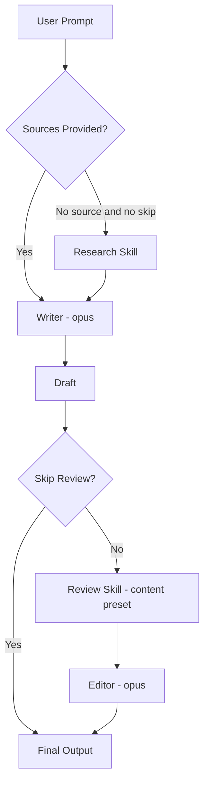

[한국어](write.ko.md)

# Write

> Produce newsletters, articles, reports, shorts, or social content. Unless skipped, research and review run as part of this skill's own default workflow.

## Quick Example

```
Write a newsletter about multi-agent AI systems
```

**What happens:** When the caller does not provide `--skip-research` or `--skip-review`, the write skill runs those phases internally: it researches, drafts in the selected format and voice, reviews through the review skill, then applies an editing pass to address Critical and Major findings. This is a write-skill default, not a hook-level trigger.

## Real-World Example

**Input:**
```
Write an expert article about the future of AI agents, approximately 800 words
```

**Process:**
1. The internal research phase uses the selected research depth (exactly 3, exactly 5, or 10+ search calls), unless skipped or source material is supplied.
2. Writer (opus) drafts in `article` format with `expert` voice: authoritative, evidence-led, domain vocabulary.
3. Length negotiation activates: article format minimum is 4,000 chars, user requested ~800. The skill informs the user and offers alternatives.
4. The internal review phase uses the `quick` preset by default (2 reviewers: devil-advocate + fact-checker), unless skipped.
5. Editor (opus) addresses all Critical and Major review findings.

**Output excerpt:**
> 2026년 3월 현재, AI 에이전트 시장은 전례 없는 속도로 성장하고 있다. Grand View Research에 따르면 글로벌 AI 에이전트 시장 규모는 2025년 76억 3천만 달러에서 2026년 109억 1천만 달러로, 단 1년 만에 43% 이상 팽창했다.
>
> **Quality check:** sources, evidence coverage, and voice consistency are reported from the actual run; no fixed score or source count is implied.

## Options

| Flag | Values | Default |
|------|--------|---------|
| `--format` | `newsletter\|article\|shorts\|report\|social\|card-news` | `article` |
| `--voice` | `peer-mentor\|expert\|casual` | format-specific |
| `--publish` | `notion\|file` | `file` |
| `--skip-research` | flag | off |
| `--skip-review` | flag | off |
| `--lang` | `ko\|en` | `ko` (set `--lang en` for English output) |
| `--input` | file path | none |
| `--constraints` | comma-separated strings | none |

### Voices

| Voice | Default For |
|-------|-------------|
| `peer-mentor` | newsletter |
| `expert` | report, article |
| `casual` | shorts, social |

### Format Rules

| Format | Minimum Length | Key Requirement |
|--------|--------------|-----------------|
| `newsletter` | 10,000 chars | 6-stage arc, 2+ research data points |
| `article` | 4,000 chars | Evidence-led structure |
| `report` | 5,000 chars | Numbered recommendations |
| `shorts` | ~1,800 chars | Mandatory CTA |
| `social` | Platform-optimized | Short post |
| `card-news` | Slide-by-slide | Visual direction per slide |

### Length Negotiation

When user-specified length conflicts with format minimums:
1. The skill informs the user of the conflict.
2. Offers alternatives: switch to a shorter format, or keep the original at full length.
3. If the user insists, respects their intent but notes the override in output metadata.

The skill never silently truncates or silently exceeds the user's request.

`--input` supplies source material and implies `--skip-research`. `--constraints`
are hard requirements injected into drafting (for example, from PDCA Act → Do).

## How It Works


```mermaid
graph TD
    A[User Prompt] --> B{Sources Provided?}
    B -->|No source and no skip| C[Research Skill]
    B -->|Yes| D[Writer - opus]
    C --> D
    D --> E[Draft]
    E --> F{Skip Review?}
    F -->|No| G[Review Skill - content preset]
    F -->|Yes| I[Final Output]
    G --> H[Editor - opus]
    H --> I
```

## Gotchas

- **Skipping research without sources** -- Do not use `--skip-research` unless real source material is already supplied. The writer needs evidence.
- **Missing CTA in shorts** -- The `shorts` and `social` formats require a call-to-action. The writer constraint enforces this.
- **Shipping unreviewed content** -- The review pass catches Critical and Major issues. Skipping it risks publishing flawed content.

## Troubleshooting

- **Length conflict between user request and format minimum** -- The skill triggers length negotiation: it informs you of the conflict and offers alternatives (switch to a shorter format, or keep the original at full length). It never silently truncates or exceeds your request.
- **Research phase is too slow** -- Use `--skip-research` and provide your own source material. The writer needs evidence, so only skip research when real sources are already supplied.
- **Output is in Korean when English was expected** -- The default language is `ko`. Set `--lang en` explicitly to get English output.
- **Review findings not applied** -- If `--skip-review` is set, no review pass runs. Remove the flag to enable automatic review and editing of Critical/Major findings.

## Works With

| Skill | Relationship |
|-------|-------------|
| research | Called internally before drafting unless `--skip-research` or source input applies |
| review | Called internally after drafting with `quick` preset unless `--skip-review` |
| workflow | Can be chained as a step in custom workflows |
| refine | Iterative improvement after review findings |
